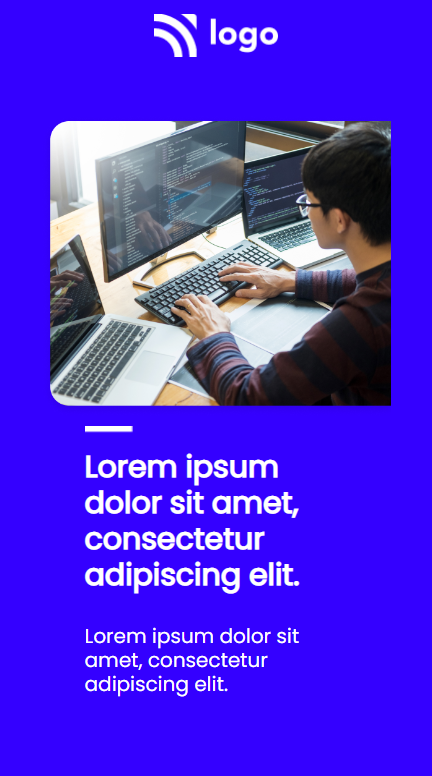
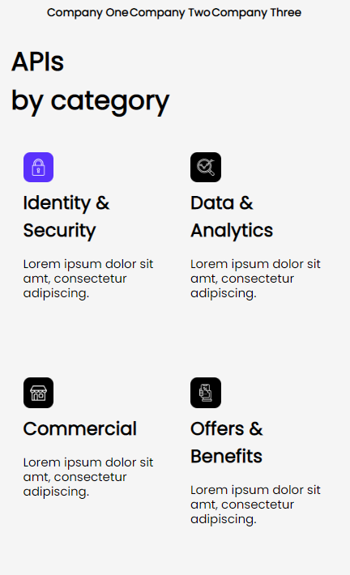
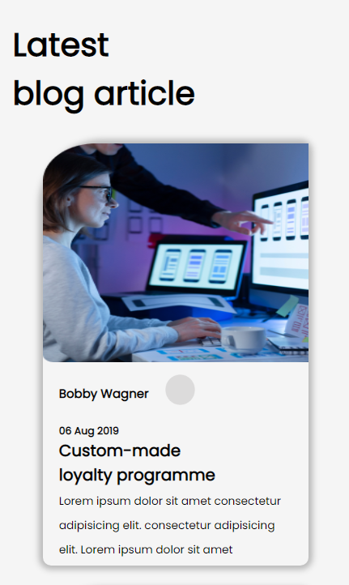
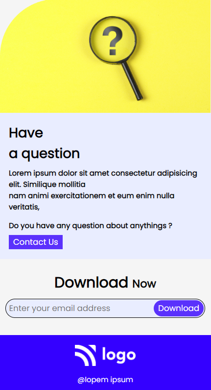

# DEVELOPER LANDING PAGE PREVIEW

[developer-web.webm](https://user-images.githubusercontent.com/72256055/192185836-d049be55-2ad4-45be-9202-336d4aadf90c.webm)

[developer-mob.webm](https://user-images.githubusercontent.com/72256055/192185848-ef1cc2fb-fbce-46c9-b411-ff380e9f108d.webm)

# DEVELOPER LANDING PAGE CLONE

**Name**: Aarya Nanndaann Singh M N

**Time**:  5 hours

**Concepts Explored**:

  Media Queries, Margin, Padding, Width, Background, Images and Couple more core concepts of CSS and HTML. 

### **Stack**:

## Metadata Of Project
**Site Type:** *STATIC*

**Responsive:** ✅

## What I Learnt

Here I got a chance to explore more about Core CSS concepts. Understood the work flow of the media queries and developing utility classes was a awesome experience. I explored width, padding, margin, background, position, background image, media-queries and a lot more core CSS concepts to get this project up and running😃.

## Live Link
**[Project in Action 🔥](https://developer-fsjs.netlify.app/)**

## Screenshots

